# 추구머니나 (ChoogooMoney)

## 서비스 소개

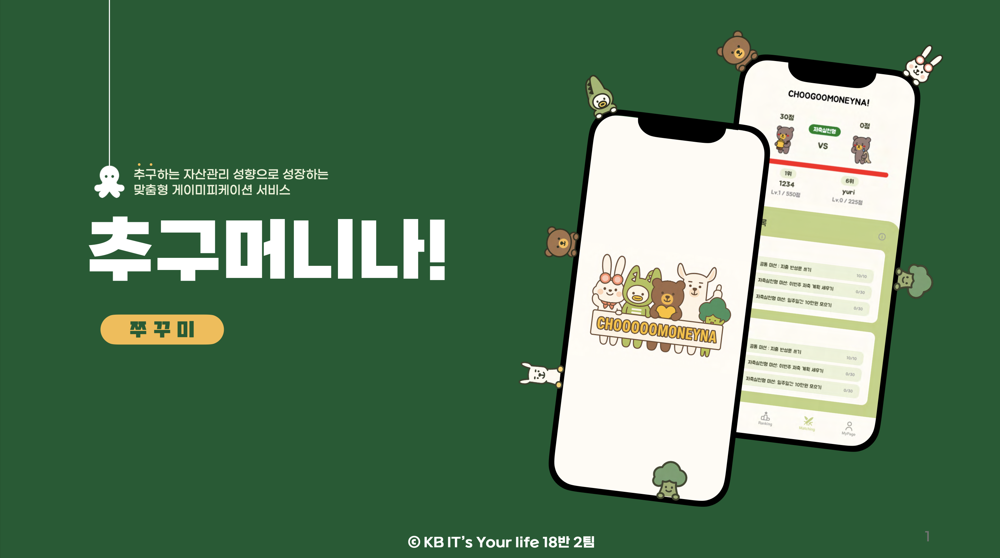

**"추구하는 자산 관리 성향으로 성장하는 개인 맞춤형 게이미피케이션 금융 서비스"**

사용자는 자신이 추구하는 자산 관리 유형을 '추구미' 캐릭터를 통해 선택합니다.<br>
실제 은행 인터넷 뱅킹 계좌 연동을 통해 실시간 자산 현황, 카테고리별 소비를 파악하며, 퀴즈와 미션, 챌린지를 통해 **자산 관리를 도움** 받을 수 있습니다.

<br>

## 서비스 선정 배경

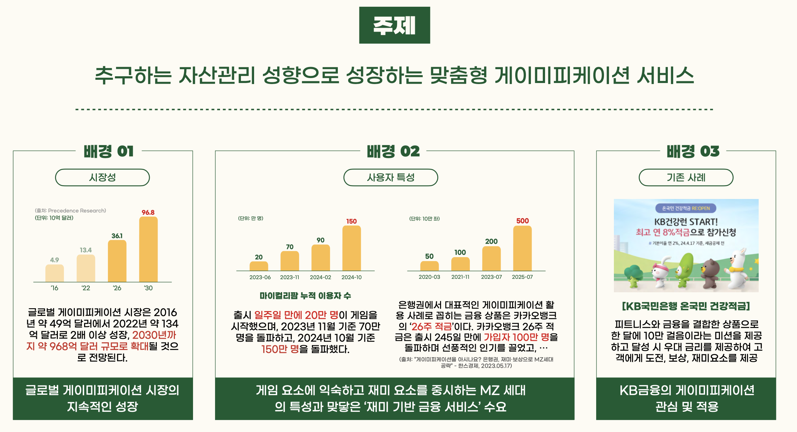

1. 게이미피케이션 시장의 지속적인 성장
2. 게임 요소에 관심을 가지는 MZ 세대와 그에 맞는 수요 증가
3. KB 국민은행의 게이미피케이션 관심과 시도

<br>

## 핵심 기능

### 1. 사전 조사 및 계좌 연동으로 리포트 생성

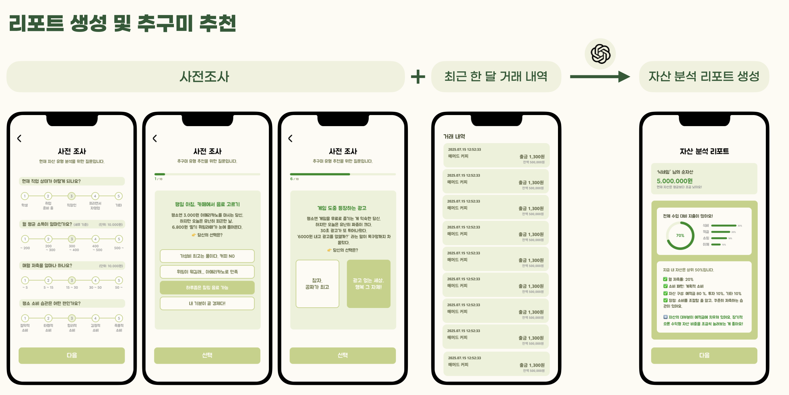
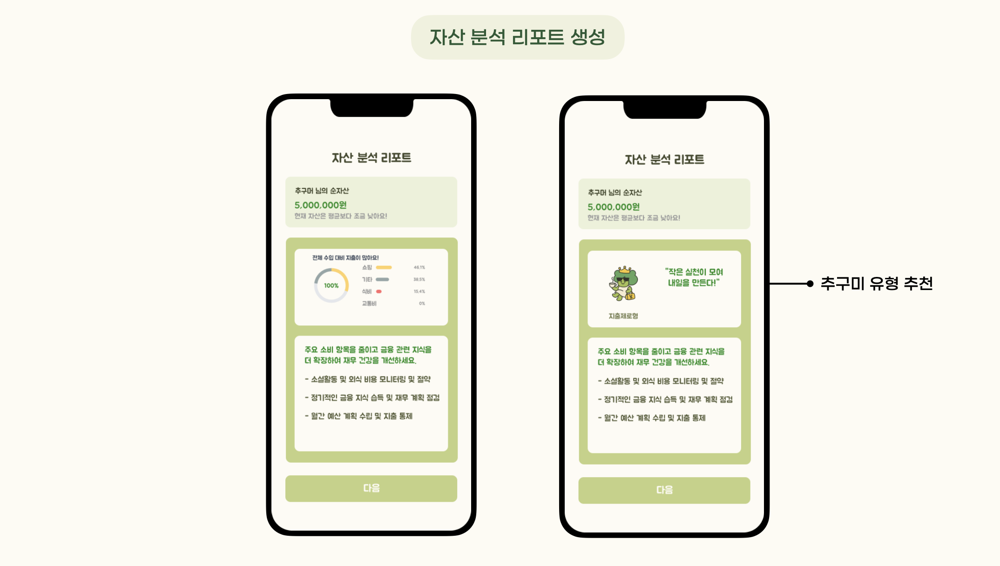

- **사전 조사** : 본인의 상황과 소비 성향 응답
- **계좌 연동** : 실제 계좌 연동으로 거래 내역 조회
- 조사 응답과 거래 내역 기반으로 **조언 및 유형 추천**

<br>

### 2. 추구미 캐릭터

<p align="center">
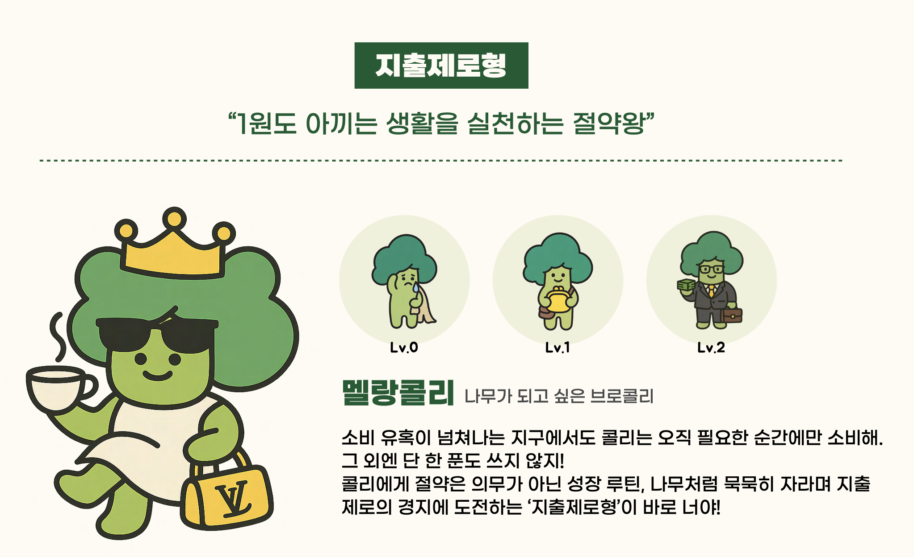
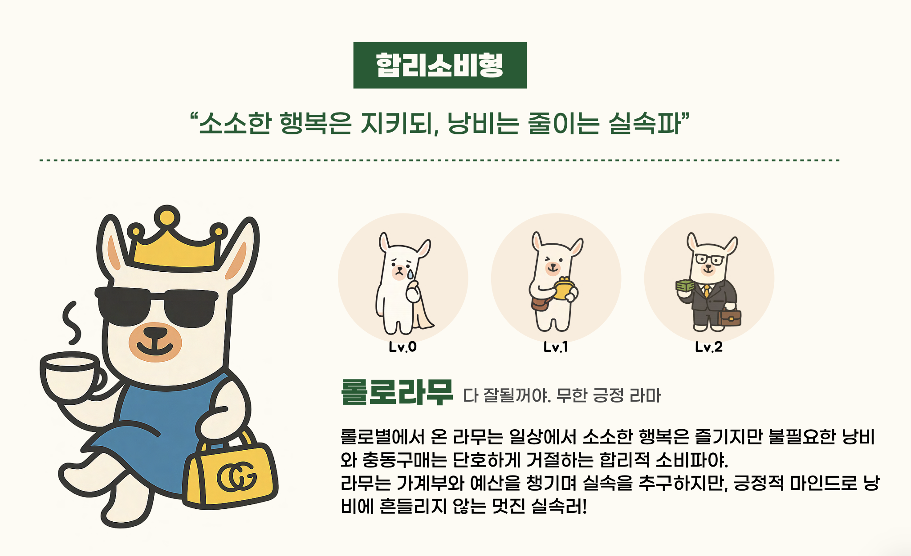
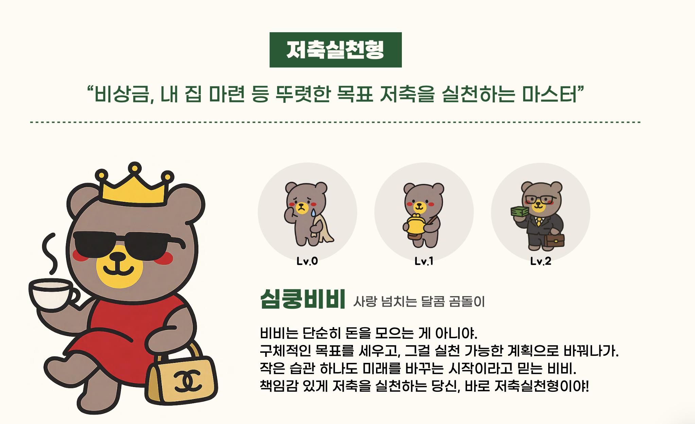
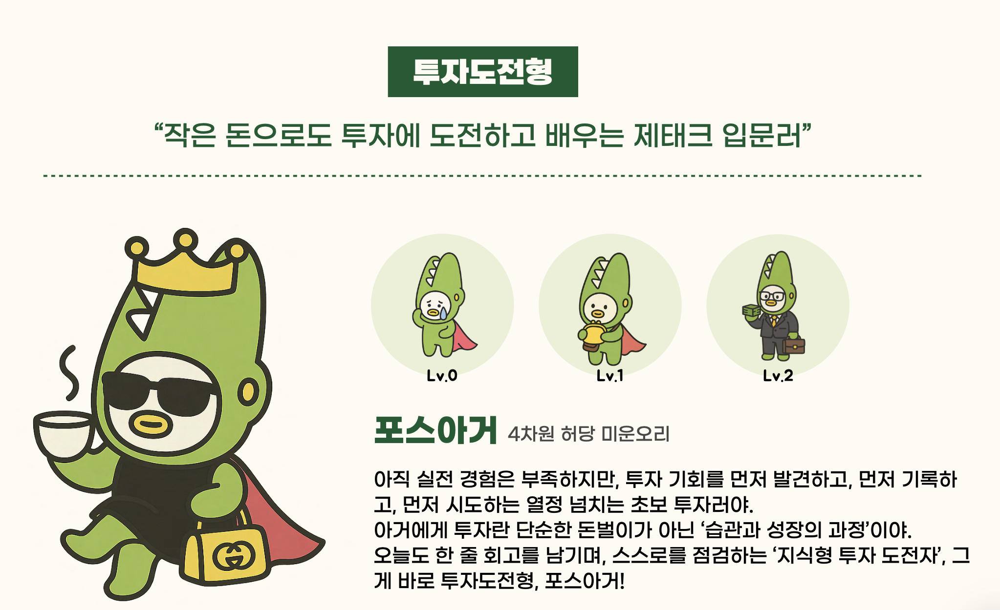
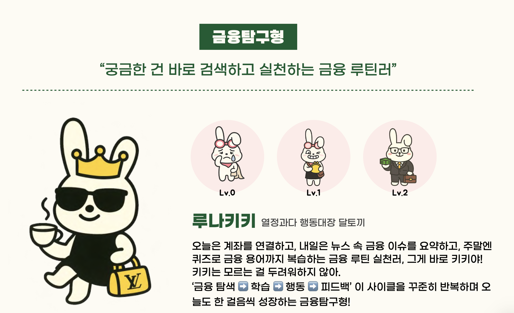
</p>

> **5가지 성향**: 지출제로형, 합리소비형, 저축실천형, 투자도전형, 금융탐구형
> **개인화된 경험**: 사용자의 소비 패턴과 목표에 맞는 캐릭터 추천
> **성장 시스템**: 레벨업과 경험치를 통한 캐릭터 성장

<br>

### 3. 매칭 및 미션

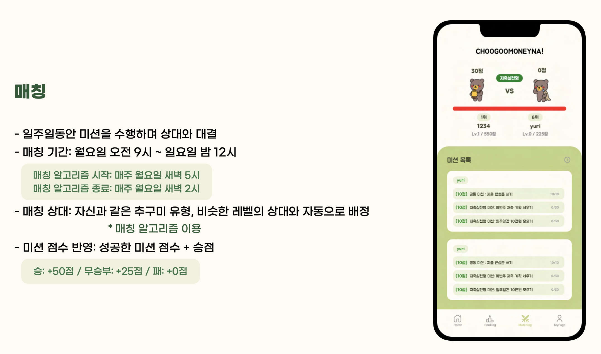

<br>
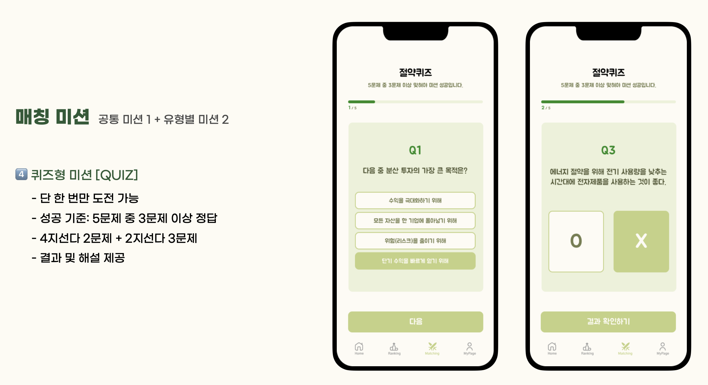
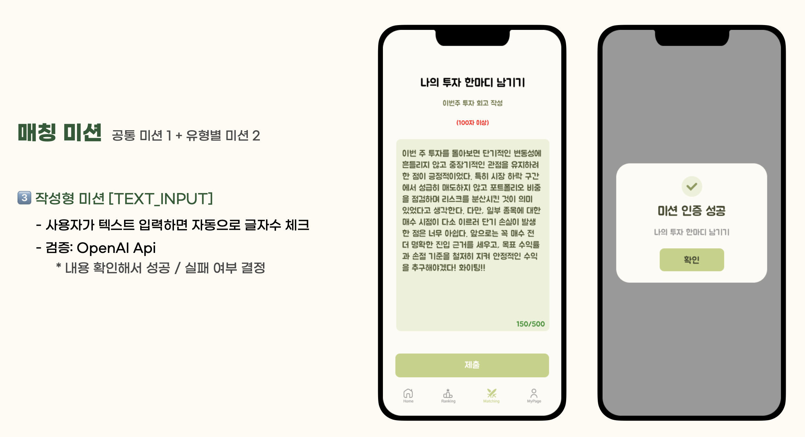

<br>

## 시스템 아키텍처

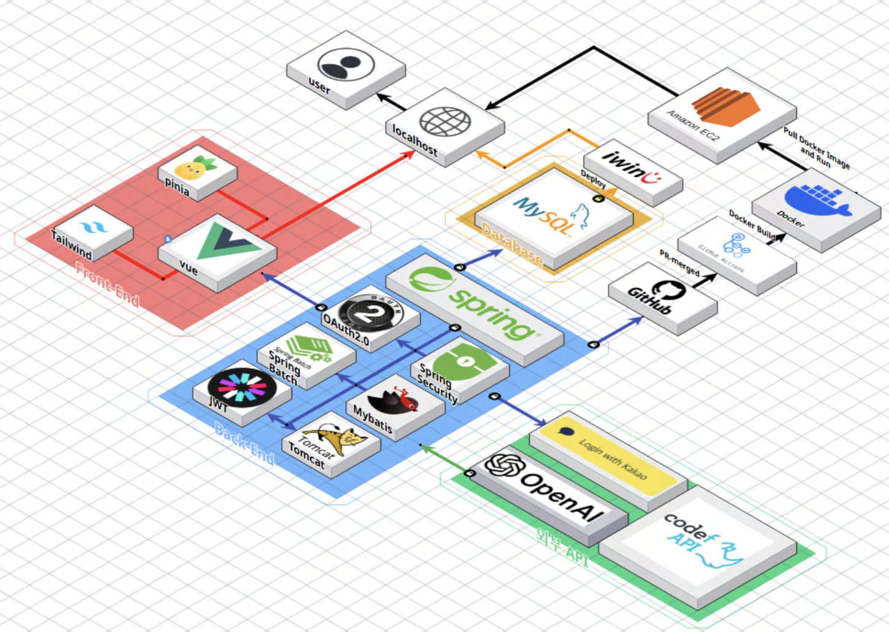

<br>

## 기술 스택

### Frontend

[](https://skillicons.dev)

### Backend

[](https://skillicons.dev)

### Deploy

[](https://skillicons.dev)

<br>

## 기술적 차별점 & 구현 포인트

### 1. 사전 조사 + AI 리포트 생성

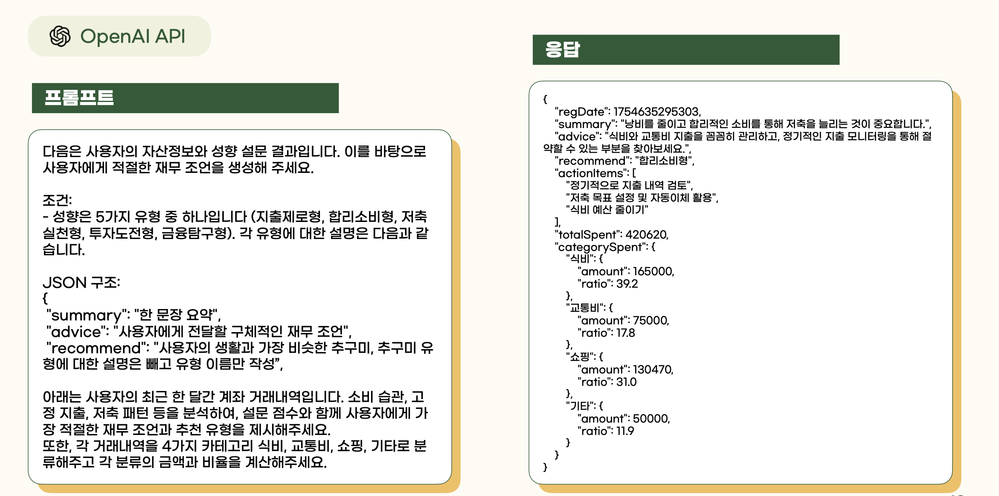

- 사전 조사 응답에 **가중치**를 부여해 사용자의 성향 계산
- 연동된 계좌 거래 내역을 카테고리 별 소비로 분류
- 성향과 거래 내역을 사용자 맞춤형 **소비 분석 리포트** 및 **개인화된 피드백**을 자동 생성
- 서비스의 유형 중에 하나를 추천

<br>

### 2. AI 기반 미션 검증 로직


- 사용자가 입력한 텍스트를 내용 검증 → 성공 / 실패 판별.
- 예: 소비 평가, 목표 작성 등 텍스트 미션에서 의미적으로 적합한지 판별

---

## ⚠️ 개발 환경 및 버전 안내

아래 버전과 설정을 팀원 모두 꼭 맞춰주세요!

- **Node.js**: v22.14.0

---

### Commit Convention

해당 작업이 어떤 작업인지 나타낸다. 첫글자는 소문자로 작성한다.

```text
- feat: 새로운 기능 추가
- chore: 오타 수정, 공백제거, 문서 이동 등 사소한 작업
- docs: 문서 작업
- fix: 버그 수정
- refactor: 리팩토링 작업
- style: 스타일 수정
```

## 프로젝트 실행 방법

### 1) 패키지 설치

```sh
npm install
```

### 2) 환경 변수 설정

`.env.local`파일을 루트 디렉토리에 생성한 다음 아래의 값들을 추가해주세요.

```js
# .env.local (예시)
VITE_API_BASE_URL= {API_URL}

# 카카오 인가 URL 전체 문자열 (client_id, redirect_uri, response_type=code 포함)
VITE_KAKAO_API_URL=https://kauth.kakao.com/oauth/authorize?client_id={YOUR_CLIENT_ID}&redirect_uri={YOUR_REDIRECT_URI}&response_type=code
```

- VITE_API_BASE_URL: 백엔드 API 서버의 베이스 URL.
- VITE_KAKAO_API_URL: 카카오 로그인 인가 요청 URL 전체. `client_id`, `redirect_uri`, `response_type=code`를 포함해야 합니다.
  - `redirect_uri`는 카카오 개발자 콘솔에 등록된 값과 반드시 동일해야 합니다.

### 3) 개발 서버 실행

```sh
npm run dev
```

브라우저가 자동으로 열리지 않는다면 로컬 주소(`http://localhost:5173`)로 접속하세요.
